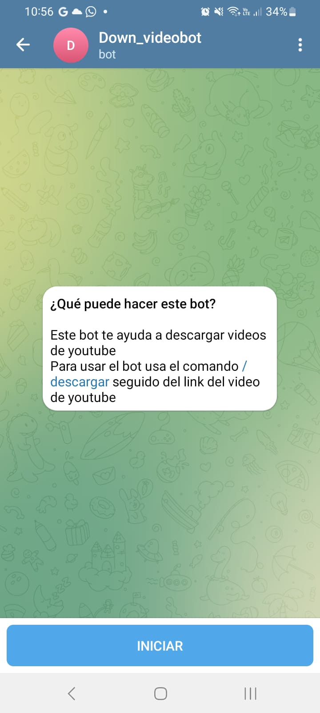

<h1>Bot-Telegram-youtube</h1>
 
<h2></h2>Este bot Descarga el audio de los videos de youtube </h2>

<h2>Resultados</h2>

Al abrir el bot mostrara las intrucciones para usarlo

 

Pedimos al bot con el comando /descargar seguido del link de youtube

 

Finalmente el bot nos respondera con un archivo de audio y el peso del audio

<h1>Para usar este codigo debes agregar tu token en el archivo login.py y instalar la librerias que indica el archivo requirements</h1>

<h3>repositorio: https://github.com/Ruben25095/Bot-Telegram-youtube/blob/ite</h3>
